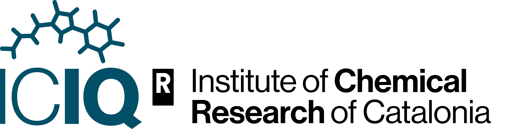

<!-- PROJECT LOGO -->
 

  

  

    The Catalan Institute of Chemistry Research (ICIQ) is an Chemistry research center with international excellence.
     
    <a href="https://iciq-dmp.github.io/"><strong>Explore the docs »</strong></a>
     
     
    <a href="https://iciq.cat">See webpage</a>
  

<!-- TABLE OF CONTENTS -->

  
Table of Contents

  <ol>
    <li><a href="#about-us">About us</a></li>
    <li><a href="#about-this-organization">About this organization</a></li>
    <li><a href="#getting-started">Getting Started</a></li>
    <li><a href="#roadmap">Roadmap</a></li>
    <li><a href="#contributing">Contributing</a></li>
    <li><a href="#contact">Contact</a></li>
    <li><a href="#acknowledgments">Acknowledgments</a></li>
  </ol>

<!-- ABOUT THE PROJECT -->
## About us
Founded in 2000 by the Government of Catalonia, the Institute of Chemical Research of Catalonia started its research 
activities in 2004. ICIQ is committed to performing excellent research at the frontier of knowledge in two main 
areas: Catalysis and Renewable Energy.

The institute also has two other commitments: knowledge and technology transfer to the chemical, pharmaceutical 
and energy industrial sectors and that of training the future generation of scientists by offering high-quality 
educational programmes to master and PhD students as well as postdoctoral researchers.

Our mission is to lead, from the vantage point of molecular science, cross-strategies for solving major social and 
economic challenges, such as climate change and sustainable supply of energetic and raw materials, thereby 
contributing to the establishment of a knowledge-based economy and improving quality of life for all.

(<a href="#readme-top">back to top</a>)

## About this organization
Since the creation of the ioChem-BD platform in 2013, ICIQ has been compromised with the digitalization of 
its research. Currently, eChempad is being developed to allow experimental researchers to digitalize their
data. 

Currently, the eChempad platform allows researchers to extract experimentation data from the 
[PerkinElmer Signals Notebook](https://perkinelmerinformatics.com/products/research/signals-notebook-eln) in bulk, 
enrich them with metadata, and finally publish them into [CORA RDR](https://dataverse.csuc.cat/) a 
[Dataverse](https://dataverse.org/) instance maintained by the 
[Consorci de Serveis Universitaris de Catalunya (CSUC)](https://www.csuc.cat/en). 

This GitHub organization is used to store all the repositories related with ICIQ digitalization.

To know more about other digitalization services at ICIQ, you can check the 
[ICIQ digitalization portal](https://d.iciq.cat) or read the 
[ICIQ digitalization documentation](https://iciq-dmp.github.io/).

(<a href="#readme-top">back to top</a>)

<!-- GETTING STARTED -->
## Getting Started
These are the links of the services available for the digitalization process at ICIQ:
| Service | Description | Link |
| --- | --- | --- |
| ioChem-BD ICIQ instance | Web platform to manage the life-cycle of theoretical chemistry data - **for ICIQ researchers** | https://iochem-bd.iciq.es/ |
| ioChem-BD public instance | Web platform to manage the life-cycle of theoretical chemistry data - **public instance** | https://www.iochem-bd.org/ |
| ICIQ digitalization portal | Static web that holds links to the main digitalization services and their documentation | https://d.iciq.cat/ |
| eChempad | Web platform to manage the life-cycle of experimental chemistry data | https://echempad.iciq.cat/ ***work-in-progress! Do not store real research data!*** |
| Chemotion | Online and open-source Chemistry notepad | https://chemotion.iciq.cat/ ***Currently down!*** |
| ICIQ digitalization documentation | Static web page used to document the digitalization at ICIQ, specially the development of *eChempad* | https://ICIQ-DMP.github.io/ |
| ICIQ data steward | Technical staff to support researchers in the digitalization process of their research. Contact in case of any doubt, problem or commentary regarding digitalization | [dmp@iciq.cat](dmp@iciq.cat) |
| Signals Notebook | Online proprietary Chemistry notepad used at ICIQ experimental groups | https://iciq.signalsnotebook.perkinelmercloud.eu/ |
| eiNa DMP | Web app developed at CSUC that easies the process of writing Data Management Plans (DMPs) for research projects | https://dmp.csuc.cat/ |
| CORA RDR | Online data repository to store the data from the catalan research | https://dataverse.csuc.cat/ |

(<a href="#readme-top">back to top</a>)

<!-- ROADMAP -->
## Roadmap
See the [open issues](https://github.com/ICIQ-DMP/roadmap/issues) in this repository for a full list of proposed features and known issues regarding ICIQ digitalization services.

(<a href="#readme-top">back to top</a>)

<!-- CONTRIBUTING -->
## Contributing
This is an open-source project, so any contributions are **greatly appreciated** ❤. 

If you have an issue or suggestion for the ICIQ digitalization plan, please 
[open a new issue](https://github.com/ICIQ-DMP/.github/issues/new) explaining your inquiry. We will try to satisfy your 
needs as soon as possible. 

(<a href="#readme-top">back to top</a>)

<!-- CONTACT -->
## Contact

>ICIQ data steward & main developer of *eChempad*: Aleix Mariné-Tena - [dmp@iciq.es](dmp@iciq.es) 📫

You can also reach us on Twitter [@ICIQchem](https://twitter.com/ICIQchem).

You can get more information of our work and research on our official web page https://iciq.cat.

(<a href="#readme-top">back to top</a>)

<!-- ACKNOWLEDGMENTS -->
## Acknowledgments
The existence of this organization was possible thanks to a grant of [*Personal Técnico de
Apoyo* (Technical staff for support) with reference *PTA2020-019734-I*](https://www.aei.gob.es/convocatorias/buscador-convocatorias/ayudas-contratos-personal-tecnico-apoyo-pta-2020)
from [*Ministerio de Ciencia e Innovación*](https://www.ciencia.gob.es/) from the [spanish government](https://www.lamoncloa.gob.es/Paginas/index.aspx).

<!-- Acknowledgement 1 -->

    <table>
	    <tr>
    	    <td style="padding:10px">
                <a href="https://www.aei.gob.es/convocatorias/buscador-convocatorias/ayudas-contratos-personal-tecnico-apoyo-pta-2020">PTA2020-019734-I</a>
      	    </td>
            <td style="padding:10px">
                The existence of this organization was possible thanks to a grant of Personal Técnico de Apoyo (Technical staff for support) from <a href="https://www.ciencia.gob.es/">Ministerio de Ciencia e Innovación</a> from the <a href="https://www.lamoncloa.gob.es/Paginas/index.aspx">spanish government</a>.
            </td>
            <td style="padding:10px">
                
                 
                
                 
                
                 
                
                 
                
            </td>
        </tr>
    </table>

<!-- Acknowledgement 2 -->

    <table>
	    <tr>
    	    <td style="padding:10px">
                <a href="https://www.ciencia.gob.es/">PID2020-112806GB-I00</a>
      	    </td>
            <td style="padding:10px">
                <a href="https://www.ciencia.gob.es/">This publication is part of the project PID2020-112806GB-I00 financed by MICIU/AEI/10.13039/501100011033</a>
            </td>
            <td style="padding:10px">
                
            </td>
        </tr>
    </table>

<!-- Acknowledgement 3 -->

    <table>
	    <tr>
    	    <td style="padding:10px">
                <a href="https://ec.europa.eu/esf/home.jsp">TED2021-132850B-I00</a>
      	    </td>
            <td style="padding:10px">
                <a href="https://ec.europa.eu/esf/home.jsp">Esta publicaciónes parte del proyecto de I+D+i TED2021-132850B-I00, financiado por MICIU/AEI/10.13039/501100011033 y por la "Union Europea Next GenerationEU/PRTR"</a>
            </td>
            <td style="padding:10px">
                
            </td>
        </tr>
    </table>

<!-- Acknowledgement 4 -->

    <table>
	    <tr>
    	    <td style="padding:10px">
                <a href="https://ec.europa.eu/esf/home.jsp">2022 INNOV 00019</a>
      	    </td>
            <td style="padding:10px">
                <a href="https://ec.europa.eu/esf/home.jsp">Ajuts innovadors 2022. Referència 2022 INNOV 00019. Amb el suport del Departament de Recerca i Universitats de la Generalitat de Catalunya.</a>
            </td>
            <td style="padding:10px">
                
                
            </td>
        </tr>
    </table>

(<a href="#readme-top">back to top</a>)

